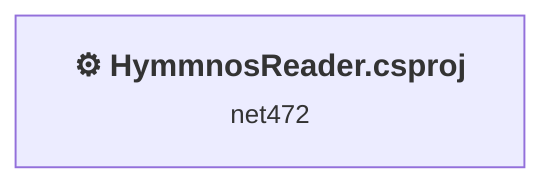
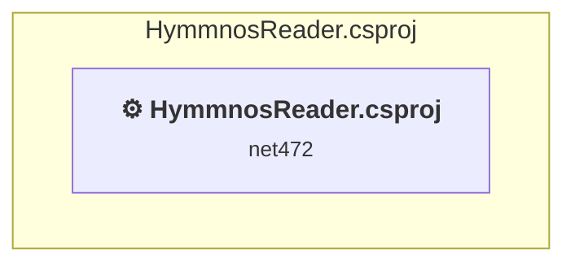

# Projects and dependencies analysis

This document provides a comprehensive overview of the projects and their dependencies in the context of upgrading to .NETCoreApp,Version=v10.0.

## Table of Contents

- [Executive Summary](#executive-Summary)
  - [Highlevel Metrics](#highlevel-metrics)
  - [Projects Compatibility](#projects-compatibility)
  - [Package Compatibility](#package-compatibility)
  - [API Compatibility](#api-compatibility)
- [Aggregate NuGet packages details](#aggregate-nuget-packages-details)
- [Top API Migration Challenges](#top-api-migration-challenges)
  - [Technologies and Features](#technologies-and-features)
  - [Most Frequent API Issues](#most-frequent-api-issues)
- [Projects Relationship Graph](#projects-relationship-graph)
- [Project Details](#project-details)

  - [HymmnosReader\HymmnosReader.csproj](#hymmnosreaderhymmnosreadercsproj)

## Executive Summary

### Highlevel Metrics

| Metric | Count | Status |
| :--- | :---: | :--- |
| Total Projects | 1 | All require upgrade |
| Total NuGet Packages | 72 | 1 need upgrade |
| Total Code Files | 7 |  |
| Total Code Files with Incidents | 5 |  |
| Total Lines of Code | 1243 |  |
| Total Number of Issues | 1205 |  |
| Estimated LOC to modify | 1152+ | at least 92.7% of codebase |

### Projects Compatibility

| Project | Target Framework | Difficulty | Package Issues | API Issues | Est. LOC Impact | Description |
| :--- | :---: | :---: | :---: | :---: | :---: | :--- |
| [HymmnosReader\HymmnosReader.csproj](#hymmnosreaderhymmnosreadercsproj) | net472 | 🟡 Medium | 51 | 1152 | 1152+ | ClassicWinForms, Sdk Style = False |

### Package Compatibility

| Status | Count | Percentage |
| :--- | :---: | :---: |
| ✅ Compatible | 71 | 98.6% |
| ⚠️ Incompatible | 0 | 0.0% |
| 🔄 Upgrade Recommended | 1 | 1.4% |
| ***Total NuGet Packages*** | ***72*** | ***100%*** |

### API Compatibility

| Category | Count | Impact |
| :--- | :---: | :--- |
| 🔴 Binary Incompatible | 1149 | High - Require code changes |
| 🟡 Source Incompatible | 3 | Medium - Needs re-compilation and potential conflicting API error fixing |
| 🔵 Behavioral change | 0 | Low - Behavioral changes that may require testing at runtime |
| ✅ Compatible | 934 |  |
| ***Total APIs Analyzed*** | ***2086*** |  |

## Aggregate NuGet packages details

| Package | Current Version | Suggested Version | Projects | Description |
| :--- | :---: | :---: | :--- | :--- |
| dotenv.net | 4.0.1 |  | [HymmnosReader.csproj](#hymmnosreaderhymmnosreadercsproj) | ✅Compatible |
| DotNetEnv | 3.1.1 |  | [HymmnosReader.csproj](#hymmnosreaderhymmnosreadercsproj) | ✅Compatible |
| Microsoft.Bcl.AsyncInterfaces | 10.0.3 |  | [HymmnosReader.csproj](#hymmnosreaderhymmnosreadercsproj) | ✅Compatible |
| Microsoft.Extensions.Configuration | 1.1.2 | 10.0.3 | [HymmnosReader.csproj](#hymmnosreaderhymmnosreadercsproj) | NuGet package upgrade is recommended |
| Microsoft.Extensions.Configuration.Abstractions | 10.0.3 |  | [HymmnosReader.csproj](#hymmnosreaderhymmnosreadercsproj) | ✅Compatible |
| Microsoft.Extensions.DependencyInjection.Abstractions | 10.0.3 |  | [HymmnosReader.csproj](#hymmnosreaderhymmnosreadercsproj) | ✅Compatible |
| Microsoft.Extensions.Diagnostics.Abstractions | 10.0.3 |  | [HymmnosReader.csproj](#hymmnosreaderhymmnosreadercsproj) | ✅Compatible |
| Microsoft.Extensions.FileProviders.Abstractions | 10.0.3 |  | [HymmnosReader.csproj](#hymmnosreaderhymmnosreadercsproj) | ✅Compatible |
| Microsoft.Extensions.Hosting.Abstractions | 10.0.3 |  | [HymmnosReader.csproj](#hymmnosreaderhymmnosreadercsproj) | ✅Compatible |
| Microsoft.Extensions.Logging.Abstractions | 10.0.3 |  | [HymmnosReader.csproj](#hymmnosreaderhymmnosreadercsproj) | ✅Compatible |
| Microsoft.Extensions.Options | 10.0.3 |  | [HymmnosReader.csproj](#hymmnosreaderhymmnosreadercsproj) | ✅Compatible |
| Microsoft.Extensions.Primitives | 10.0.3 |  | [HymmnosReader.csproj](#hymmnosreaderhymmnosreadercsproj) | ✅Compatible |
| Microsoft.NETCore.Platforms | 1.1.0 |  | [HymmnosReader.csproj](#hymmnosreaderhymmnosreadercsproj) | NuGet package functionality is included with framework reference |
| Microsoft.Win32.Primitives | 4.3.0 |  | [HymmnosReader.csproj](#hymmnosreaderhymmnosreadercsproj) | NuGet package functionality is included with framework reference |
| NETStandard.Library | 1.6.1 |  | [HymmnosReader.csproj](#hymmnosreaderhymmnosreadercsproj) | NuGet package functionality is included with framework reference |
| OpenAI | 2.8.0 |  | [HymmnosReader.csproj](#hymmnosreaderhymmnosreadercsproj) | ✅Compatible |
| Sprache | 2.3.1 |  | [HymmnosReader.csproj](#hymmnosreaderhymmnosreadercsproj) | ✅Compatible |
| System.AppContext | 4.3.0 |  | [HymmnosReader.csproj](#hymmnosreaderhymmnosreadercsproj) | NuGet package functionality is included with framework reference |
| System.Buffers | 4.6.1 |  | [HymmnosReader.csproj](#hymmnosreaderhymmnosreadercsproj) | NuGet package functionality is included with framework reference |
| System.ClientModel | 1.9.0 |  | [HymmnosReader.csproj](#hymmnosreaderhymmnosreadercsproj) | ✅Compatible |
| System.Collections | 4.3.0 |  | [HymmnosReader.csproj](#hymmnosreaderhymmnosreadercsproj) | NuGet package functionality is included with framework reference |
| System.Collections.Concurrent | 4.3.0 |  | [HymmnosReader.csproj](#hymmnosreaderhymmnosreadercsproj) | NuGet package functionality is included with framework reference |
| System.Console | 4.3.0 |  | [HymmnosReader.csproj](#hymmnosreaderhymmnosreadercsproj) | NuGet package functionality is included with framework reference |
| System.Diagnostics.Debug | 4.3.0 |  | [HymmnosReader.csproj](#hymmnosreaderhymmnosreadercsproj) | NuGet package functionality is included with framework reference |
| System.Diagnostics.DiagnosticSource | 10.0.3 |  | [HymmnosReader.csproj](#hymmnosreaderhymmnosreadercsproj) | ✅Compatible |
| System.Diagnostics.Tools | 4.3.0 |  | [HymmnosReader.csproj](#hymmnosreaderhymmnosreadercsproj) | NuGet package functionality is included with framework reference |
| System.Diagnostics.Tracing | 4.3.0 |  | [HymmnosReader.csproj](#hymmnosreaderhymmnosreadercsproj) | NuGet package functionality is included with framework reference |
| System.Globalization | 4.3.0 |  | [HymmnosReader.csproj](#hymmnosreaderhymmnosreadercsproj) | NuGet package functionality is included with framework reference |
| System.Globalization.Calendars | 4.3.0 |  | [HymmnosReader.csproj](#hymmnosreaderhymmnosreadercsproj) | NuGet package functionality is included with framework reference |
| System.IO | 4.3.0 |  | [HymmnosReader.csproj](#hymmnosreaderhymmnosreadercsproj) | NuGet package functionality is included with framework reference |
| System.IO.Compression | 4.3.0 |  | [HymmnosReader.csproj](#hymmnosreaderhymmnosreadercsproj) | NuGet package functionality is included with framework reference |
| System.IO.Compression.ZipFile | 4.3.0 |  | [HymmnosReader.csproj](#hymmnosreaderhymmnosreadercsproj) | NuGet package functionality is included with framework reference |
| System.IO.FileSystem | 4.3.0 |  | [HymmnosReader.csproj](#hymmnosreaderhymmnosreadercsproj) | NuGet package functionality is included with framework reference |
| System.IO.FileSystem.Primitives | 4.3.0 |  | [HymmnosReader.csproj](#hymmnosreaderhymmnosreadercsproj) | NuGet package functionality is included with framework reference |
| System.IO.Pipelines | 10.0.3 |  | [HymmnosReader.csproj](#hymmnosreaderhymmnosreadercsproj) | ✅Compatible |
| System.Linq | 4.3.0 |  | [HymmnosReader.csproj](#hymmnosreaderhymmnosreadercsproj) | NuGet package functionality is included with framework reference |
| System.Linq.Expressions | 4.3.0 |  | [HymmnosReader.csproj](#hymmnosreaderhymmnosreadercsproj) | NuGet package functionality is included with framework reference |
| System.Memory | 4.6.3 |  | [HymmnosReader.csproj](#hymmnosreaderhymmnosreadercsproj) | NuGet package functionality is included with framework reference |
| System.Memory.Data | 10.0.3 |  | [HymmnosReader.csproj](#hymmnosreaderhymmnosreadercsproj) | ✅Compatible |
| System.Net.Http | 4.3.4 |  | [HymmnosReader.csproj](#hymmnosreaderhymmnosreadercsproj) | NuGet package functionality is included with framework reference |
| System.Net.Primitives | 4.3.0 |  | [HymmnosReader.csproj](#hymmnosreaderhymmnosreadercsproj) | NuGet package functionality is included with framework reference |
| System.Net.ServerSentEvents | 10.0.3 |  | [HymmnosReader.csproj](#hymmnosreaderhymmnosreadercsproj) | ✅Compatible |
| System.Net.Sockets | 4.3.0 |  | [HymmnosReader.csproj](#hymmnosreaderhymmnosreadercsproj) | NuGet package functionality is included with framework reference |
| System.Numerics.Vectors | 4.6.1 |  | [HymmnosReader.csproj](#hymmnosreaderhymmnosreadercsproj) | NuGet package functionality is included with framework reference |
| System.ObjectModel | 4.3.0 |  | [HymmnosReader.csproj](#hymmnosreaderhymmnosreadercsproj) | NuGet package functionality is included with framework reference |
| System.Reflection | 4.3.0 |  | [HymmnosReader.csproj](#hymmnosreaderhymmnosreadercsproj) | NuGet package functionality is included with framework reference |
| System.Reflection.Extensions | 4.3.0 |  | [HymmnosReader.csproj](#hymmnosreaderhymmnosreadercsproj) | NuGet package functionality is included with framework reference |
| System.Reflection.Primitives | 4.3.0 |  | [HymmnosReader.csproj](#hymmnosreaderhymmnosreadercsproj) | NuGet package functionality is included with framework reference |
| System.Resources.ResourceManager | 4.3.0 |  | [HymmnosReader.csproj](#hymmnosreaderhymmnosreadercsproj) | NuGet package functionality is included with framework reference |
| System.Runtime | 4.3.0 |  | [HymmnosReader.csproj](#hymmnosreaderhymmnosreadercsproj) | NuGet package functionality is included with framework reference |
| System.Runtime.CompilerServices.Unsafe | 6.1.2 |  | [HymmnosReader.csproj](#hymmnosreaderhymmnosreadercsproj) | ✅Compatible |
| System.Runtime.Extensions | 4.3.0 |  | [HymmnosReader.csproj](#hymmnosreaderhymmnosreadercsproj) | NuGet package functionality is included with framework reference |
| System.Runtime.Handles | 4.3.0 |  | [HymmnosReader.csproj](#hymmnosreaderhymmnosreadercsproj) | ✅Compatible |
| System.Runtime.InteropServices | 4.3.0 |  | [HymmnosReader.csproj](#hymmnosreaderhymmnosreadercsproj) | NuGet package functionality is included with framework reference |
| System.Runtime.InteropServices.RuntimeInformation | 4.3.0 |  | [HymmnosReader.csproj](#hymmnosreaderhymmnosreadercsproj) | NuGet package functionality is included with framework reference |
| System.Runtime.Numerics | 4.3.0 |  | [HymmnosReader.csproj](#hymmnosreaderhymmnosreadercsproj) | NuGet package functionality is included with framework reference |
| System.Security.Cryptography.Algorithms | 4.3.0 |  | [HymmnosReader.csproj](#hymmnosreaderhymmnosreadercsproj) | NuGet package functionality is included with framework reference |
| System.Security.Cryptography.Encoding | 4.3.0 |  | [HymmnosReader.csproj](#hymmnosreaderhymmnosreadercsproj) | NuGet package functionality is included with framework reference |
| System.Security.Cryptography.Primitives | 4.3.0 |  | [HymmnosReader.csproj](#hymmnosreaderhymmnosreadercsproj) | NuGet package functionality is included with framework reference |
| System.Security.Cryptography.X509Certificates | 4.3.0 |  | [HymmnosReader.csproj](#hymmnosreaderhymmnosreadercsproj) | NuGet package functionality is included with framework reference |
| System.Text.Encoding | 4.3.0 |  | [HymmnosReader.csproj](#hymmnosreaderhymmnosreadercsproj) | NuGet package functionality is included with framework reference |
| System.Text.Encoding.Extensions | 4.3.0 |  | [HymmnosReader.csproj](#hymmnosreaderhymmnosreadercsproj) | NuGet package functionality is included with framework reference |
| System.Text.Encodings.Web | 10.0.3 |  | [HymmnosReader.csproj](#hymmnosreaderhymmnosreadercsproj) | ✅Compatible |
| System.Text.Json | 10.0.3 |  | [HymmnosReader.csproj](#hymmnosreaderhymmnosreadercsproj) | ✅Compatible |
| System.Text.RegularExpressions | 4.3.1 |  | [HymmnosReader.csproj](#hymmnosreaderhymmnosreadercsproj) | NuGet package functionality is included with framework reference |
| System.Threading | 4.3.0 |  | [HymmnosReader.csproj](#hymmnosreaderhymmnosreadercsproj) | NuGet package functionality is included with framework reference |
| System.Threading.Tasks | 4.3.0 |  | [HymmnosReader.csproj](#hymmnosreaderhymmnosreadercsproj) | NuGet package functionality is included with framework reference |
| System.Threading.Tasks.Extensions | 4.6.3 |  | [HymmnosReader.csproj](#hymmnosreaderhymmnosreadercsproj) | NuGet package functionality is included with framework reference |
| System.Threading.Timer | 4.3.0 |  | [HymmnosReader.csproj](#hymmnosreaderhymmnosreadercsproj) | NuGet package functionality is included with framework reference |
| System.ValueTuple | 4.6.2 |  | [HymmnosReader.csproj](#hymmnosreaderhymmnosreadercsproj) | NuGet package functionality is included with framework reference |
| System.Xml.ReaderWriter | 4.3.0 |  | [HymmnosReader.csproj](#hymmnosreaderhymmnosreadercsproj) | NuGet package functionality is included with framework reference |
| System.Xml.XDocument | 4.3.0 |  | [HymmnosReader.csproj](#hymmnosreaderhymmnosreadercsproj) | NuGet package functionality is included with framework reference |

## Top API Migration Challenges

### Technologies and Features

| Technology | Issues | Percentage | Migration Path |
| :--- | :---: | :---: | :--- |
| Windows Forms | 1149 | 99.7% | Windows Forms APIs for building Windows desktop applications with traditional Forms-based UI that are available in .NET on Windows. Enable Windows Desktop support: Option 1 (Recommended): Target net9.0-windows; Option 2: Add <UseWindowsDesktop>true</UseWindowsDesktop>; Option 3 (Legacy): Use Microsoft.NET.Sdk.WindowsDesktop SDK. |
| Windows Forms Legacy Controls | 408 | 35.4% | Legacy Windows Forms controls that have been removed from .NET Core/5+ including StatusBar, DataGrid, ContextMenu, MainMenu, MenuItem, and ToolBar. These controls were replaced by more modern alternatives. Use ToolStrip, MenuStrip, ContextMenuStrip, and DataGridView instead. |
| Legacy Configuration System | 2 | 0.2% | Legacy XML-based configuration system (app.config/web.config) that has been replaced by a more flexible configuration model in .NET Core. The old system was rigid and XML-based. Migrate to Microsoft.Extensions.Configuration with JSON/environment variables; use System.Configuration.ConfigurationManager NuGet package as interim bridge if needed. |
| GDI+ / System.Drawing | 1 | 0.1% | System.Drawing APIs for 2D graphics, imaging, and printing that are available via NuGet package System.Drawing.Common. Note: Not recommended for server scenarios due to Windows dependencies; consider cross-platform alternatives like SkiaSharp or ImageSharp for new code. |

### Most Frequent API Issues

| API | Count | Percentage | Category |
| :--- | :---: | :---: | :--- |
| T:System.Windows.Forms.RadioButton | 175 | 15.2% | Binary Incompatible |
| T:System.Windows.Forms.DataGridViewTextBoxColumn | 90 | 7.8% | Binary Incompatible |
| T:System.Windows.Forms.Label | 80 | 6.9% | Binary Incompatible |
| T:System.Windows.Forms.DataGridView | 61 | 5.3% | Binary Incompatible |
| T:System.Windows.Forms.GroupBox | 49 | 4.3% | Binary Incompatible |
| T:System.Windows.Forms.DataGridViewAutoSizeColumnMode | 30 | 2.6% | Binary Incompatible |
| P:System.Windows.Forms.Control.Name | 28 | 2.4% | Binary Incompatible |
| T:System.Windows.Forms.Control.ControlCollection | 27 | 2.3% | Binary Incompatible |
| P:System.Windows.Forms.Control.Controls | 27 | 2.3% | Binary Incompatible |
| M:System.Windows.Forms.Control.ControlCollection.Add(System.Windows.Forms.Control) | 27 | 2.3% | Binary Incompatible |
| P:System.Windows.Forms.Control.TabIndex | 27 | 2.3% | Binary Incompatible |
| P:System.Windows.Forms.Control.Size | 27 | 2.3% | Binary Incompatible |
| P:System.Windows.Forms.Control.Location | 27 | 2.3% | Binary Incompatible |
| P:System.Windows.Forms.Label.Text | 26 | 2.3% | Binary Incompatible |
| T:System.Windows.Forms.CheckBox | 25 | 2.2% | Binary Incompatible |
| P:System.Windows.Forms.ButtonBase.UseVisualStyleBackColor | 16 | 1.4% | Binary Incompatible |
| P:System.Windows.Forms.ButtonBase.Text | 16 | 1.4% | Binary Incompatible |
| P:System.Windows.Forms.ButtonBase.AutoSize | 15 | 1.3% | Binary Incompatible |
| P:System.Windows.Forms.RadioButton.Checked | 14 | 1.2% | Binary Incompatible |
| E:System.Windows.Forms.RadioButton.CheckedChanged | 13 | 1.1% | Binary Incompatible |
| M:System.Windows.Forms.RadioButton.#ctor | 13 | 1.1% | Binary Incompatible |
| T:System.Windows.Forms.DataGridViewColumnCollection | 12 | 1.0% | Binary Incompatible |
| P:System.Windows.Forms.DataGridView.Columns | 12 | 1.0% | Binary Incompatible |
| T:System.Windows.Forms.DataGridViewRowCollection | 11 | 1.0% | Binary Incompatible |
| P:System.Windows.Forms.DataGridView.Rows | 11 | 1.0% | Binary Incompatible |
| T:System.Windows.Forms.Button | 11 | 1.0% | Binary Incompatible |
| T:System.Windows.Forms.TextBox | 10 | 0.9% | Binary Incompatible |
| T:System.Windows.Forms.DataGridViewColumn | 10 | 0.9% | Binary Incompatible |
| P:System.Windows.Forms.DataGridViewColumnCollection.Item(System.Int32) | 10 | 0.9% | Binary Incompatible |
| T:System.Windows.Forms.DataGridViewColumnHeaderCell | 10 | 0.9% | Binary Incompatible |
| P:System.Windows.Forms.DataGridViewColumn.HeaderCell | 10 | 0.9% | Binary Incompatible |
| T:System.Windows.Forms.DataGridViewCellStyle | 10 | 0.9% | Binary Incompatible |
| P:System.Windows.Forms.DataGridViewCell.Style | 10 | 0.9% | Binary Incompatible |
| P:System.Windows.Forms.DataGridViewCellStyle.BackColor | 10 | 0.9% | Binary Incompatible |
| P:System.Windows.Forms.DataGridViewColumn.ReadOnly | 10 | 0.9% | Binary Incompatible |
| P:System.Windows.Forms.DataGridViewColumn.Name | 10 | 0.9% | Binary Incompatible |
| P:System.Windows.Forms.DataGridViewColumn.MinimumWidth | 10 | 0.9% | Binary Incompatible |
| P:System.Windows.Forms.DataGridViewColumn.HeaderText | 10 | 0.9% | Binary Incompatible |
| F:System.Windows.Forms.DataGridViewAutoSizeColumnMode.Fill | 10 | 0.9% | Binary Incompatible |
| P:System.Windows.Forms.DataGridViewColumn.AutoSizeMode | 10 | 0.9% | Binary Incompatible |
| M:System.Windows.Forms.DataGridViewTextBoxColumn.#ctor | 10 | 0.9% | Binary Incompatible |
| M:System.Windows.Forms.DataGridViewRowCollection.Add(System.Object[]) | 6 | 0.5% | Binary Incompatible |
| T:System.Windows.Forms.MessageBoxIcon | 6 | 0.5% | Binary Incompatible |
| T:System.Windows.Forms.MessageBoxButtons | 6 | 0.5% | Binary Incompatible |
| P:System.Windows.Forms.Label.AutoSize | 6 | 0.5% | Binary Incompatible |
| T:System.Windows.Forms.DataGridViewColumnHeadersHeightSizeMode | 6 | 0.5% | Binary Incompatible |
| M:System.Windows.Forms.Label.#ctor | 6 | 0.5% | Binary Incompatible |
| P:System.Windows.Forms.RadioButton.TabStop | 5 | 0.4% | Binary Incompatible |
| M:System.Windows.Forms.DataGridViewRowCollection.Clear | 4 | 0.3% | Binary Incompatible |
| P:System.Windows.Forms.DataGridView.EnableHeadersVisualStyles | 4 | 0.3% | Binary Incompatible |

## Projects Relationship Graph

Legend:
📦 SDK-style project
⚙️ Classic project

## Project Details

### HymmnosReader\HymmnosReader.csproj

#### Project Info

- **Current Target Framework:** net472
- **Proposed Target Framework:** net10.0-windows
- **SDK-style**: False
- **Project Kind:** ClassicWinForms
- **Dependencies**: 0
- **Dependants**: 0
- **Number of Files**: 11
- **Number of Files with Incidents**: 5
- **Lines of Code**: 1243
- **Estimated LOC to modify**: 1152+ (at least 92.7% of the project)

#### Dependency Graph

Legend:
📦 SDK-style project
⚙️ Classic project

### API Compatibility

| Category | Count | Impact |
| :--- | :---: | :--- |
| 🔴 Binary Incompatible | 1149 | High - Require code changes |
| 🟡 Source Incompatible | 3 | Medium - Needs re-compilation and potential conflicting API error fixing |
| 🔵 Behavioral change | 0 | Low - Behavioral changes that may require testing at runtime |
| ✅ Compatible | 934 |  |
| ***Total APIs Analyzed*** | ***2086*** |  |

#### Project Technologies and Features

| Technology | Issues | Percentage | Migration Path |
| :--- | :---: | :---: | :--- |
| Legacy Configuration System | 2 | 0.2% | Legacy XML-based configuration system (app.config/web.config) that has been replaced by a more flexible configuration model in .NET Core. The old system was rigid and XML-based. Migrate to Microsoft.Extensions.Configuration with JSON/environment variables; use System.Configuration.ConfigurationManager NuGet package as interim bridge if needed. |
| GDI+ / System.Drawing | 1 | 0.1% | System.Drawing APIs for 2D graphics, imaging, and printing that are available via NuGet package System.Drawing.Common. Note: Not recommended for server scenarios due to Windows dependencies; consider cross-platform alternatives like SkiaSharp or ImageSharp for new code. |
| Windows Forms Legacy Controls | 408 | 35.4% | Legacy Windows Forms controls that have been removed from .NET Core/5+ including StatusBar, DataGrid, ContextMenu, MainMenu, MenuItem, and ToolBar. These controls were replaced by more modern alternatives. Use ToolStrip, MenuStrip, ContextMenuStrip, and DataGridView instead. |
| Windows Forms | 1149 | 99.7% | Windows Forms APIs for building Windows desktop applications with traditional Forms-based UI that are available in .NET on Windows. Enable Windows Desktop support: Option 1 (Recommended): Target net9.0-windows; Option 2: Add <UseWindowsDesktop>true</UseWindowsDesktop>; Option 3 (Legacy): Use Microsoft.NET.Sdk.WindowsDesktop SDK. |

